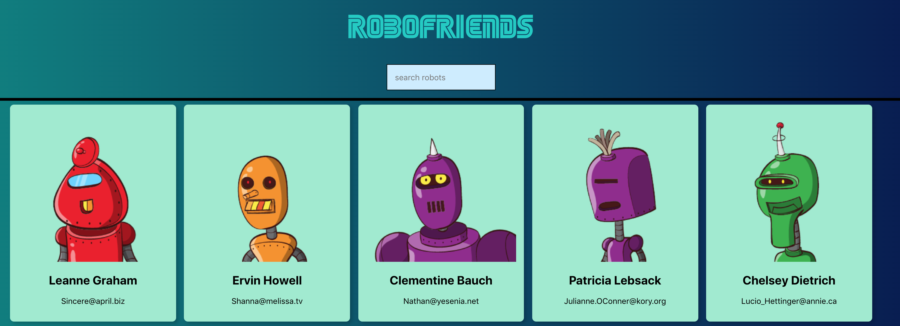

# robofriends

# My First React Web App
This Project is an experimental React Web App to learn about React. It lets you search for robots and shows you the results in real-time. It was done in relation to the Udemy Course https://www.udemy.com/course/the-complete-web-developer-zero-to-mastery/learn/lecture/12529642#overview 

# Learned Concepts: 
- Installation & use of npm
- Setup of a React Web App
- One Way Data Flow of React Apps
- Props & State 
- Components & Containers
- Virtual DOM
- Ecosystem & Syntax of React
- Error Boundries
- Flux Pattern
- State Management with Redux
- Redux Action, Reducer, Store
- Provider and connect
- Middleware & redux-logger


# Screenshot



# Installation
1. Clone this repository
2. Run ```npm install```
3. run ```npm start```


# Project status
This project was created for learning purposes only and therefore, its development has stopped. 